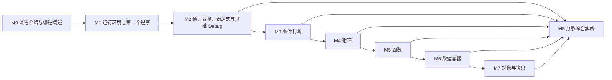

# Python 编程与计算思维入门 · 课程蓝图

> 状态：v0.2，教师审核通过，可进入 M0 样板制作
> 更新日期：2026-07-22
> 总时长：6 天，12 课时，每课时 50 分钟，共 600 分钟
> 上位依据：[`course-decisions.md`](course-decisions.md)
> 规划基线：[`course-outline.md`](course-outline.md)

## 1. 文档用途

本文把课程规划基线细化为可执行的内容架构，回答以下问题：

- 每个模块必须讲什么、讲到什么深度
- 模块之间有哪些真实依赖，哪些顺序可以调整
- 600 分钟如何分配，落后或超前时怎样调整
- 编程思维如何落实为课堂活动和可观察成果
- 实践如何分散到课程全过程，而不被三个“项目实践”课时锁定

本文已经完成课程结构审核。下一步先制作 M0 完整样板；样板通过后，再批量制作其余模块的教师教案、学生讲义、示例、练习和 PPT。

## 2. 总体设计

### 2.1 时间模型

课程内容按 550 分钟的建议路线设计，保留 50 分钟机动时间。机动时间用于环境故障、课堂提问、阶段补练、学生差异和成果讲解，不预先填满。

| 时间类型 | 分钟 | 用途 |
| --- | ---: | --- |
| 模块建议时间 | 550 | 核心讲解、跟练、独立任务和分散实践 |
| 机动时间 | 50 | 故障处理、补练、扩展、展示和跨天调整 |
| 总计 | 600 | 6 天 × 2 课时 × 50 分钟 |

每个模块提供三档时间：

- **最低**：进度落后时仍必须保留的完整学习闭环，不是只讲语法结论。
- **建议**：正常路线的备课基准。
- **扩展**：学生进度快时可以使用的上限；不能把所有模块扩展时间相加后视为可执行课表。

### 2.2 全课程问题解决流程

所有模块反复使用同一套流程：

```text
明确问题
-> 明确输入、输出、规则和约束
-> 构造具体例子
-> 拆分可执行步骤
-> 选择状态和数据表示
-> 编写最小可运行版本
-> 手动追踪执行过程
-> 使用正常、边界和异常情况测试
-> 定位问题、修改和重新验证
-> 解释方案并比较可能的改进
```

不同模块只改变关注重点，不改变这套基本工作方式。

## 3. 模块依赖



### 3.1 顺序约束

- M0 固定为课程开篇。
- M1 应在首次独立编程前完成，只建立编辑、运行和观察输出的基本操作。
- M2 先讲值、变量、类型、输入输出和表达式，再讲系统化基础 Debug；此后的每个模块重复使用排错流程。
- M2 是 M3–M7 的共同基础。
- M3 应先于 M4，以便循环中使用条件和处理边界。
- 推荐先完成 M4 再进入 M5，使函数示例可以封装真实控制流程。
- 推荐先完成 M5 再系统讲 M6，使容器操作能够尽快被拆成函数；若课堂需要，可以在 M4 提前预览简单列表，但不展开方法体系。
- M7 依赖嵌套容器、函数参数和对象修改经验，应放在 M5、M6 之后。
- M8 不是只在结尾出现的独立章节，而是在 M2 之后持续累积的实践时间。

## 4. 模块总览与时间

| 模块 | 最低 | 建议 | 扩展 | 主要成果 |
| --- | ---: | ---: | ---: | --- |
| M0 · 课程介绍与编程概述 | 20 | 30 | 40 | 能把一个问题区分为问题、算法和程序 |
| M1 · 运行环境与第一个程序 | 20 | 25 | 40 | 能独立创建、运行和修改第一个程序 |
| M2 · 值、变量、表达式与基础 Debug | 55 | 80 | 100 | 能实现输入—计算—输出程序并完成一次有依据的排错 |
| M3 · 条件判断 | 40 | 55 | 70 | 能按边界和覆盖关系设计完整分支 |
| M4 · 循环 | 50 | 70 | 90 | 能设计会终止的循环并追踪状态变化 |
| M5 · 函数 | 45 | 65 | 85 | 能按职责拆分函数并设计参数与返回值 |
| M6 · 数据容器 | 75 | 105 | 130 | 能根据问题选择并操作合适的数据结构 |
| M7 · 对象与拷贝 | 40 | 55 | 75 | 能解释别名、副作用和深浅拷贝差异 |
| M8 · 分散综合实践 | 40 | 65 | 100 | 能完成从问题分析到测试讲解的闭环 |
| **合计** | **385** | **550** | **730** | 扩展时间不能同时全部采用 |

## 5. 详细模块边界

### M0 · 课程介绍与编程概述

**知识目标**

- 认识编程的主要应用方向：软件与 Web、移动应用与游戏、自动化与工具、科学计算与数据分析、人工智能、嵌入式与硬件控制。
- 知道学习编程不仅包括语言语法，还包括问题分析、算法、数据表示、工具、调试、测试和协作。
- 理解本课程选择 Python、控制台程序和基础问题求解作为入口的原因。
- 知道程序是由计算机精确执行的指令集合。
- 区分现实问题、算法和具体代码。
- 认识输入—处理—输出以及程序状态的基本模型。
- 知道编程在大学理工科学习、实验、数据处理和自动化中的作用。

**建议叙事顺序**

1. 编程能构建什么、会出现在哪些大学学习和研究场景中。
2. 学习编程实际要学习哪些层次，而不只是背语法。
3. 本课程为什么选择 Python，为什么聚焦控制台程序与编程思维。
4. 从一个现实问题进入问题、算法、程序和输入—处理—输出模型。

**思维目标**

- 把模糊任务改写为明确目标、输入、输出、规则和约束。
- 使用一个具体例子检查步骤是否足够精确。
- 认识“能想到答案”和“能写出可执行步骤”的差别。

**必须活动**

- 一张编程应用与能力构成的全景图。
- 一次“本课程会学什么、暂时不学什么、为什么这样选择”的定位说明。
- 一个不使用代码的精确指令或算法活动。
- 一个输入—处理—输出拆解任务。
- 一个极短程序的运行结果预测。

**边界**

- 编程领域全景用于建立坐标，不逐项讲技术栈、职业路线或语言排行榜。
- 不展开 Python 历史，只说明其适合作为本课程入口的直接原因。
- 不在开篇堆叠后续语法名词。
- 不使用“清北苗子”等内部学生画像表述。

### M1 · 运行环境与第一个程序

**知识目标**

- 理解 Python 解释器、`.py` 文件、编辑器和运行结果之间的关系。
- 能按课程安装指南完成 Python 与编辑器的安装尝试和环境确认。
- 能创建、保存、运行和重新运行一个程序。
- 认识 `print()`、字符串和从上到下执行的最小直观模型。

**思维目标**

- 区分代码文件、运行命令和输出结果。
- 通过修改后重新运行，建立“代码变化会导致程序行为变化”的最初反馈闭环。
- 确认当前编辑文件与实际运行文件一致。

**必须活动**

- 独立运行并修改一个最小程序。
- 完成一次解释器、编辑文件和运行结果的环境确认。
- 确认编辑文件、运行文件和实际输出一致。

**边界**

- 软件安装指南应在课前发放，学生先自行尝试；M1 负责环境确认、必要安装救援和备用环境切换。
- 课程考核学生能否独立创建、保存和运行程序，不考核其记忆安装器选项或操作系统配置细节。
- 现场无法完成安装时先切换到已准备的备用环境，不让设备问题阻断编程学习。
- M1 只处理“让第一个程序成功运行”所必需的问题，不系统讲 Traceback 和错误类型。
- 基础 Debug 安排在 M2 后半，学生已经接触值、变量、类型和表达式后再讲。
- 不讲虚拟环境、包管理、命令行系统知识和 IDE 全功能巡览。

### M2 · 值、变量、表达式与基础 Debug

**知识目标**

- 字面量与 `int`、`float`、`str`、`bool` 四种基本类型。
- 变量、赋值、重新赋值、标识符和 `snake_case` 命名。
- `print()`、`input()`、`type()`、`len()` 以及 `int()`、`float()`、`str()` 转换。
- 算术运算、复合赋值、运算顺序和必要括号。
- 字符串、引号、常用转义字符、拼接和 f-string。
- 注释用于说明目的、假设和关键决策。
- 在完成上述基础后，认识 Traceback、错误类型、行号和最后一行错误信息。
- 结合已经学过的语法认识 `SyntaxError`、`NameError`、`TypeError`、`ValueError`。

**思维目标**

- 用变量表示会变化或需要重复使用的状态。
- 按执行顺序计算表达式，并区分值、类型和显示形式。
- 将输入数据转换为问题真正需要的类型。
- 用最小中间输出检查计算过程。
- 把报错和异常输出当作证据，形成“观察—提出一个假设—只改一处—重新验证”的排错流程。
- 区分程序无法运行和程序运行但结果错误。

**必须活动**

- 手动追踪多次赋值后的变量值。
- 预测字符串与数值表达式的结果和类型。
- 独立完成一个“输入—计算—格式化输出”程序。
- 修复至少一个字符串与数字混用导致的错误。
- 根据 Traceback 的错误类型和行号，独立完成一次有依据的故障修复和复测。

**边界**

- `eval()` 不用于输入转换，也不作为核心内容。
- 不系统讲浮点表示误差，只通过一个现象说明结果可能需要格式化或近似理解。
- 不讲位运算、复数和高级字符串格式协议。
- 断点和单步调试可以在本模块末尾演示，但最低档只要求读报错、临时输出和最小修改。

### M3 · 条件判断

**知识目标**

- 比较运算符、布尔结果以及 `and`、`or`、`not`。
- `if`、`if-else`、`if-elif-else` 和必要的嵌套判断。
- 冒号、缩进和代码块的执行范围。
- 多个独立 `if` 与互斥分支的区别。
- 条件顺序、范围边界和无法到达的分支。

**思维目标**

- 把输入空间划分为互斥或可重叠的情况。
- 检查边界是否遗漏、重叠或顺序错误。
- 为每个分支构造至少一个可到达的测试值。
- 比较嵌套判断与逻辑组合的可读性。

**必须活动**

- 根据条件表达式预测真假。
- 使用数轴或表格设计分支边界。
- 独立实现一个包含至少三个结果的决策程序。
- 修复一个边界错误或分支顺序错误。

**边界**

- 三元条件表达式不作为核心内容。
- 不依赖异常处理实现输入验证。
- 核心任务可以验证文本菜单和已经成功转换的数值范围；无法转换的数值输入只讨论风险，完整处理留给 `try-except` 扩展。
- 避免为了展示语法而制造深层嵌套。

### M4 · 循环

**知识目标**

- `while` 的条件、循环体、初始状态和状态更新。
- `for`、`range()` 的开始、结束、步长和左闭右开规则。
- 计数、累计、查找、输入重试等基本循环模式。
- `break`、`continue` 的作用范围和适用场景。
- `while` 与 `for` 的选择。

**思维目标**

- 识别问题中的重复结构和每轮变化的状态。
- 说明循环开始条件、持续条件和终止原因。
- 使用跟踪表观察计数器、累计值和当前输入。
- 通过 0 次、1 次、多次和边界次数测试循环。

**必须活动**

- 手工追踪一个累计循环。
- 修复一个无法终止或更新方向错误的循环。
- 分别完成一个固定次数和一个条件控制的循环任务。
- 解释一次 `break` 或 `continue` 对本轮和整个循环的影响。

**边界**

- 嵌套循环只讲执行模型和一个简单案例，复杂图案与多层嵌套作为扩展。
- 循环 `else` 不作为核心内容。
- 可以在 `for` 中遍历字符串；列表只作必要预览，不在本模块展开方法体系。

### M5 · 函数

**知识目标**

- `def`、函数名、调用、形参、实参和执行返回点。
- `return` 返回值与仅产生输出的函数之间的区别。
- `None` 表示没有有效结果，以及没有显式 `return` 的函数会返回 `None`。
- 局部作用域，以及读取外部变量可能带来的依赖。
- 将重复步骤或独立职责提取为函数。

**思维目标**

- 用一句话说明函数的单一职责。
- 把函数看作有输入、输出和约束的契约。
- 区分“计算结果”和“显示结果”。
- 通过参数减少隐藏依赖，通过返回值传递结果。

**必须活动**

- 手动追踪函数调用、参数绑定和返回过程。
- 将一段顺序代码拆成至少两个职责明确的函数。
- 使用多个输入调用同一函数并检查结果。
- 修复一个忘记 `return` 或混淆局部变量的错误。

**边界**

- 不把 `global` 修改作为常规方案。
- 默认参数、关键字参数和 `assert` 可作为扩展。
- 匿名函数、递归、装饰器、生成器和高阶函数不在核心范围。
- 不要求完整讲授函数注解；命名和简单契约说明优先。

### M6 · 数据容器

**建议时间内部结构**

| 子部分 | 建议时间 | 深度 |
| --- | ---: | --- |
| 列表 | 30 | 独立创建、修改、遍历和汇总 |
| 字典 | 30 | 独立建模、读取、更新和遍历 |
| 集合与元组 | 20 | 典型用途、核心操作和行为比较 |
| 容器选择与嵌套桥接 | 15 | 选择依据、列表与字典组合、为 M7 准备嵌套数据 |
| 检查点 | 10 | 选择、编写、测试和解释 |

**知识目标**

- 列表：作为主要有序可变容器，完成创建、索引、切片、遍历和典型增删改查。
- 字典：作为主要键值容器，完成读取、更新、成员判断和键值遍历。
- 集合：聚焦唯一性、成员判断、去重以及一种基本集合运算。
- 元组：聚焦固定顺序、解包、索引以及不可修改的基本特点。
- 字符串作为不可变序列，与列表、元组的相同点和差异。
- 根据顺序、唯一性、键值关系和可变需求选择容器。

**思维目标**

- 先分析数据关系，再选择数据结构。
- 区分“一个值”“一组有序值”“键值记录”和“唯一成员集合”。
- 用遍历和函数处理一组数据，而不是复制多份相似代码。
- 识别容器结构是否让后续操作更简单或更困难。

**必须活动**

- 为几个问题比较并选择列表、字典、集合或元组。
- 使用列表完成一次收集、遍历和汇总。
- 使用字典表达一种有字段含义的数据，并与列表组合或比较。
- 使用集合完成一个去重或成员判断微型任务。
- 对元组完成一次解包、读取和“不能原地修改”的预测。
- 完成一个接收或返回容器的函数。

**边界**

- 不按方法清单逐项讲授，只选择能支持典型操作的方法。
- 列表、字典和集合推导式作为扩展，不作为最低要求。
- 排序不进入核心要求；进度快时只扩展 `sorted()` 或一种列表排序方式，不展开自定义复杂排序。
- 不讲 `collections`、迭代器协议和生成器。
- 嵌套容器只达到支持数据建模和 M7 拷贝案例所需的深度。

### M7 · 对象与拷贝

**知识目标**

- 变量名、对象和值之间的基本关系。
- 相等 `==` 与对象身份 `is` 的区别，以及 `is None` 的惯用法。
- 重新绑定、原地修改、别名和函数副作用。
- 不可变对象与可变对象的行为差异。
- 直接赋值、浅拷贝和深拷贝在嵌套容器中的不同结果。
- 使用 `copy.copy()`、`copy.deepcopy()` 或等价浅拷贝方式解决明确的所有权问题。
- 为使用 `copy` 标准库进行一次最小导入，不延伸为模块系统教学。

**思维目标**

- 画出变量与对象的引用关系，而不是把变量想成始终独立的盒子。
- 预测一次修改会影响哪些名称和嵌套对象。
- 根据是否需要共享内部对象决定是否复制以及复制多深。
- 识别函数修改传入容器所产生的副作用。

**必须活动**

- 对一段别名代码先画引用图，再预测输出。
- 比较重新赋值与原地修改的结果。
- 在嵌套列表或字典上比较赋值、浅拷贝和深拷贝。
- 修复一个因共享状态导致的实际 bug，并解释修复选择。

**边界**

- 不讲 CPython 引用计数、垃圾回收实现、内存地址细节和不可变对象缓存。
- 不把深拷贝描述成通用安全方案；必须结合数据所有权和修改需求。
- 不要求学生记忆所有容器的复制方法。

### M8 · 分散综合实践

M8 不增加新的语法清单，而是把其他模块的知识放入完整问题解决过程。实践可以由多个任务组成，不要求一个项目包含全部知识点。

**实践目标**

- 从问题说明中提取输入、输出、规则、状态和边界。
- 先实现最小可运行版本，再逐步增加功能。
- 使用正常、边界和异常情况验证程序。
- 在功能正确后重构命名、函数和数据结构。
- 向他人解释一个关键控制流程、数据选择和调试过程。

**最低成果证据**

课程结束时，学生应提交或现场展示以下组合证据：

1. 一个或多个可独立运行的程序，合计展示输入输出、条件、循环、函数和至少一种容器。
2. 一项针对可变性、别名或深浅拷贝的独立预测、找错或修复任务。
3. 一份简短说明，解释问题拆分、测试用例以及一次调试或重构决策。

不要求一个项目或文件包含全部知识点。深浅拷贝不强制塞入综合程序；如果问题本身没有复制需求，使用独立任务验证理解更合理。

### M8 与其他模块的时间关系

- M0–M7 的建议时间已经包含本模块内的预测、跟随修改、独立编写和调试任务。
- M8 的 65 分钟专门用于跨模块的阶段综合和课程成果，不是额外添加在 550 分钟之外的时间。
- 微型任务、阶段综合和课程成果是实践规模分类，不是三笔可以相加的新预算。
- 同一个任务可以同时形成模块检查点和课程成果证据，不需要重复完成同类任务。

## 6. 最低档内容定义

最低时间不能靠把建议路线倍速播放实现。使用最低档时，应按下表减少广度和活动数量，同时保留“理解—编写—测试—解释”的闭环。

| 模块 | 最低档必须保留 | 从最低档移出 |
| --- | --- | --- |
| M0 | 编程全景与课程定位简述；问题、算法、程序；输入—处理—输出；一次无代码拆解 | 应用领域细节、职业展开和多个类比活动 |
| M1 | 环境确认、独立创建运行、修改后重跑、确认实际运行文件 | Traceback、错误类型和系统排错流程 |
| M2 | 四种基本类型、变量、输入输出、必要转换、核心运算、f-string、读报错和一次最小排错 | 复杂转义、浮点现象、断点单步和更多格式细节 |
| M3 | 比较与逻辑、完整 `if-elif-else`、缩进、边界测试 | 多层嵌套、复杂短路分析、多种等价改写 |
| M4 | 一个 `while`、一个 `for`、`range()`、状态更新、终止性 | 复杂嵌套；`break`、`continue` 只保留一个代表案例 |
| M5 | 定义调用、参数、返回值、`None`、局部作用域、一次职责拆分 | 默认参数、关键字参数、注解和额外重构轮次 |
| M6 | 列表和字典的独立操作；集合去重；元组读取与不可变性；容器选择比较 | 方法广度、排序、推导式、复杂嵌套变换 |
| M7 | 别名、重新绑定与原地修改；一组嵌套数据的浅拷贝和深拷贝 | 多种复制 API、实现细节和多个副作用案例 |
| M8 | 跨模块成果证据、拷贝专项证据和简短解释 | 项目包装、附加功能、集中展示和界面美化 |

建议路线中的“必须活动”是正常备课要求；启用最低档时，以本表为准合并或减少活动，但不能删除独立编写和验证。

## 7. 全课程主动排除项

以下内容不进入核心路线，避免在 10 小时内稀释基本思维训练：

- 面向对象、类与继承
- 文件读写、数据库和网络访问
- 第三方库、数据分析框架和可视化库
- 模块系统、包管理和虚拟环境的系统讲解
- 递归、匿名函数、装饰器、生成器和异步编程
- 正则表达式
- 正式算法复杂度分析
- 自动化测试框架

`try-except`、推导式、默认参数、关键字参数、`assert` 和简单排序可作为扩展内容。扩展内容只能在对应核心检查点已经通过后加入。

## 8. 实践与评价结构

### 8.1 六种课堂活动

| 活动 | 目的 | 典型产物 |
| --- | --- | --- |
| 预测 | 暴露执行模型和条件理解 | 输出、真假或下一步判断 |
| 追踪 | 看清变量、参数和引用变化 | 状态表、调用图或引用图 |
| 修改 | 从可运行代码进入主动控制 | 参数、规则或输出的变化版本 |
| 独立编写 | 检查能否脱离逐行提示 | 从问题说明完成的小程序 |
| 调试 | 使用证据定位语法、运行或逻辑错误 | 原因假设、最小修改和复测结果 |
| 解释比较 | 建立可迁移的方法意识 | 方案选择、边界说明或口头讲解 |

### 8.2 实践层级

- **微型任务**：5–12 分钟，包含在 M0–M7 模块时间内，集中验证单一思维动作。
- **阶段综合**：通常 15–30 分钟，从 M8 的 65 分钟中分配，组合多个知识点。
- **课程成果**：从 M8 中累计投入约 30–50 分钟，可以复用阶段综合代码，不要求集中完成。

### 8.3 建议路线活动配置

除 M0、M1 外，每个模块至少包含：

- 1 个运行前预测或手工追踪
- 1 个跟随修改任务
- 1 个独立编写任务
- 1 个有代表性的错误案例
- 1 次边界或反例检查
- 1 个要求学生解释“为什么”的问题

M0 至少完成一次无代码问题拆解；M1 至少完成一次独立创建、运行和修改；M2 在基础语法之后至少完成一次有依据的排错。启用最低档时，活动合并规则见第 6 节。

### 8.4 课程成果证据组合

课程目标不由最后一个项目单独承担。教师应通过课堂文件、检查表、抽查或现场讲解保留以下证据：

| 证据 | 对应能力 |
| --- | --- |
| M1 第一个程序检查点 | 环境确认、创建、运行、修改和运行文件确认 |
| M2 输入—计算—输出与排错任务 | 变量、类型、转换、表达式求值、格式化输出、错误信息和验证流程 |
| M3 分支任务 | 条件设计、边界与分支覆盖 |
| M4 循环任务 | `while`、`for`、状态更新和终止性 |
| M5 函数任务 | 参数、返回值、局部作用域和职责拆分 |
| M6 数据建模任务 | 列表、字典的使用，以及集合、元组的选择依据 |
| M7 引用与拷贝任务 | 可变性、别名、副作用、浅拷贝和深拷贝 |
| M8 综合成果与说明 | 问题拆解、实现、测试、调试、重构和解释 |

证据可以来自多个互不相关的任务，不要求汇总为单一大项目。M6 的综合程序可以只使用最适合问题的容器；对其他容器的掌握由选择题、预测题或短任务证明。

## 9. 六天推荐路线

下表是正常进度下的组合方案，不改变对外课表，也不是固定逐分钟教案。

| 天次 | 建议内容 | 分钟 | 当天检查点 | 助教 |
| ---: | --- | ---: | --- | --- |
| 1 | M0 30 + M1 25 + M2 30 + 机动 15 | 100 | 能独立运行程序，并追踪一次输入、赋值和输出 | 梁健、谢雨荷 |
| 2 | M2 50 + M3 45 + 机动 5 | 100 | 能根据错误信息完成基础排错，并完成基本分支 | 梁健 |
| 3 | M3 10 + M4 70 + M8 15 + 机动 5 | 100 | 能写出会终止的循环并解释状态更新 | 梁健 |
| 4 | M5 65 + M6 30 + 机动 5 | 100 | 能用参数和返回值拆分职责，并开始用列表组织数据 | 谢雨荷 |
| 5 | M6 75 + M8 15 + 机动 10 | 100 | 能为问题选择容器并用函数处理数据 | 谢雨荷 |
| 6 | M7 55 + M8 35 + 机动 10 | 100 | 能解释引用与拷贝，并提供完整课程成果证据 | 梁健、谢雨荷 |

M8 建议时间在第 3、5、6 天累计 65 分钟。各模块内部的跟练、独立任务和调试已经包含在 M0–M7 时间内。第一天优先保留 15 分钟机动，以吸收设备与环境问题。

## 10. 进度调整规则

### 10.1 进度落后

优先压缩：

- 背景介绍和重复演示
- 高级字符串格式、复杂嵌套和方法数量
- 默认参数、关键字参数、推导式、`assert` 和排序扩展
- 大型项目包装、界面美化和集中展示人数

必须保留：

- 独立运行与基本 Debug
- 输入输出、变量、类型转换和核心运算
- 完整条件分支和边界检查
- 至少一种 `while` 与一种 `for` 的独立编写
- 参数、返回值和局部作用域
- 列表、字典、集合、元组的选择依据与核心操作
- 别名、原地修改、浅拷贝和深拷贝的行为比较
- 独立编写、测试、调试和解释时间

不得通过取消学生独立编写来追赶进度。应减少方法数量、题目包装和扩展难度。

### 10.2 进度超前

按以下顺序增加难度：

1. 增加边界、反例和错误输入。
2. 比较两种控制流或数据结构方案。
3. 要求学生重构函数接口和减少隐藏状态。
4. 增加嵌套数据与复制策略判断。
5. 引入推导式、默认参数、关键字参数、`assert` 或简单排序。

扩展任务不提前进入类、第三方库或与主线无关的新语法体系。

### 10.3 跨天移动

- 每天结束以检查点而不是章节页码判断进度。
- 未通过检查点时，下一天先用 5–10 分钟检索练习和最小补练，再继续新内容。
- 可以移动 M8 实践时间，也可以把 M6 的方法扩展移到下一天。
- M7 不应提前到学生尚未实际修改过容器和传递过函数参数之前。

## 11. 材料制作约束

后续每个模块至少交付：

- `teacher-guide.md`：知识目标、思维目标、依赖、时间档位、活动流程、助教任务和调整规则
- `student-handout.md`：概念速查、预测与追踪、跟随修改、独立任务、调试和总结
- `slides-content.md`：学生视角的 PPT 内容稿
- `slides.html`：通过内容审核后实现的可投影课件
- `examples/`：最小示例、故障示例和参考结果
- `exercises/`：核心任务、扩展任务和教师答案

学生材料不暴露内部学生画像、教师答案和进度删减规则。所有代码示例必须能够运行，故障示例必须明确标记为故意错误。

## 12. 审核结论

教师于 2026-07-22 完成蓝图审核，结论如下：

1. M0–M8 的整体划分通过；M1 改为环境与第一个程序，系统化基础 Debug 移至 M2 后半。
2. 550 分钟内容加 50 分钟机动的时间模型通过。
3. 保留函数先于系统容器教学的推荐顺序；M6–M8 的示例与实践持续使用函数，增加复现和迁移机会。
4. 主动排除项通过；M0 先介绍编程的应用与能力全景，再说明本课程的定位、选择和边界。
5. 跨模块最低成果证据通过。
6. 六天推荐路线作为正常进度基准通过，实际授课时继续按检查点调整。

课程蓝图已满足进入 M0 样板制作的条件。具体实践主题和 PPT 最终视觉实现仍在相应样板阶段单独审核。
