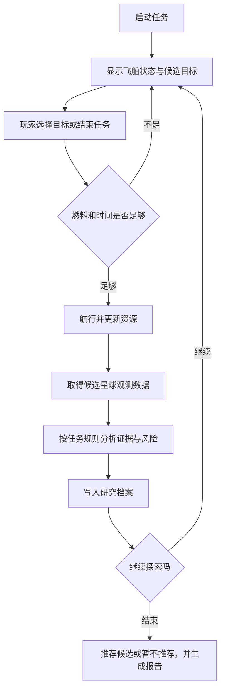

# 群星彼岸 · 贯穿式项目实施计划

> 状态：v0.1，详细方案初稿，待教师审核
> 更新日期：2026-07-22
> 课程时长：6 天，12 课时，每课时 50 分钟
> 主题依据：[`project-theme.md`](project-theme.md)
> 课程蓝图：[`curriculum-map.md`](curriculum-map.md)

## 1. 文档用途

本文把已经确定的“群星彼岸：宜居行星探索计划”细化为可实施的贯穿式项目，回答以下问题：

- 最终文字游戏运行时包含哪些状态、规则和操作
- 项目怎样从零基础程序逐步成长，而不提前使用尚未讲授的知识
- 12 个课时分别完成什么项目任务、留下什么可检查成果
- 学生在哪些位置可以自由选择科研、玩法、工程或叙事扩展
- 进度落后时怎样缩减包装，同时保留完整学习证据

本文是项目设计初稿，不替代课程蓝图。模块知识边界、时间预算和最低成果证据仍以 [`curriculum-map.md`](curriculum-map.md) 为准。

## 2. 最终项目定义

### 2.1 一句话目标

学生完成一个控制台科研探索游戏：驾驶深空探测舰访问目标星系，扫描候选星球，依据任务采用的宜居性筛查规则分析证据，在燃料和任务时间有限的条件下选择行动，并提交最终候选及理由；如果当前证据不足，也可以作出“暂不推荐任何已观测候选”的结论并提出下一步观测建议。

### 2.2 玩家可执行的核心行动

- 查看飞船燃料、剩余时间和已经完成的研究记录
- 查看尚未访问的目标星系及基础航行信息
- 选择目标并判断当前资源是否允许航行
- 对候选星球执行扫描，取得气候与环境观测数据
- 根据多项指标判断“优先候选、需要更多观测或不建议继续”
- 把观测结论和风险原因加入研究档案
- 在任务结束时推荐最终候选，或决定暂不推荐，并解释证据、权衡和限制

### 2.3 核心完成条件

最终成果至少应满足：

1. 程序可以独立运行并正常结束。
2. 程序包含输入输出、条件、循环、函数和至少一种主要数据容器。
3. 程序能够处理至少 3 个具有不同特征的候选星球。
4. 宜居性结论同时考虑多项指标，并输出判断理由，而不是只显示一个总分。
5. 学生使用正常、边界和不利条件完成至少 3 次测试。
6. 学生能解释一个控制流程、一个数据结构选择以及一次调试或重构决定。
7. 学生完成一次与别名、共享状态或深浅拷贝有关的独立任务；是否并入最终程序由设计合理性决定。

自由扩展不能替代上述核心条件。扩展功能较多但核心流程不可靠，不视为完成；是否成功完成扩展也不影响核心成果是否达成。

### 2.4 最低可交付版本

进度落后时，项目可以从自主探索游戏降级为固定顺序的科研任务，但仍须满足以下验收合同：

- 依次处理 3 个具有不同特征的候选星球。
- 只维护燃料一种消耗资源，并在不足时安全终止。
- 对每个星球给出优先候选、需要更多观测或不建议继续三类结论之一及理由。
- 保存或输出已经处理的星球和研究结论。
- 任务结束时生成报告，允许结论为“当前不推荐任何候选”。
- 保留课程蓝图要求的条件、循环、函数、容器、测试和拷贝专项证据。

最低版本可以移除自由选路、任务时间、事件和自由扩展，但不能退化为只判断一个数值的一次性程序。

## 3. 整体实现方案

### 3.1 六个每日快照

项目保留一个连续世界观，但不要求学生从第一天起维护同一个不断膨胀的文件。每一天形成一个能够独立运行的快照，下一天从已经验证的版本继续或重组。

| 天次 | 建议工作文件 | 当日形成的能力 | 恢复点 |
| ---: | --- | --- | --- |
| 1 | `mission_d1_terminal.py` | 启动任务终端，表示并显示基本飞船状态 | 能运行并输出任务信息的最小文件 |
| 2 | `mission_d2_climate.py` | 接收观测数据，计算并判断单个星球 | 单星球输入—计算—判断程序 |
| 3 | `mission_d3_exploration.py` | 重复扫描、维护资源并控制任务终止 | 条件与循环综合版本 |
| 4 | `mission_d4_pipeline.py` | 用函数拆分计算、判断和显示，并开始收集数据 | 函数化的单星球分析管线 |
| 5 | `mission_d5_catalog.py` | 建立多星球目录、风险标签和研究档案 | 容器化的行星气候沙盘 |
| 6 | `mission_d6_final.py` | 处理任务副本，完成最终探索、测试和报告 | 可展示的课程成果 |

文件名是备课建议，不要求学生记忆。教师材料不额外建立示例代码目录；必要的起始片段、故障版本和恢复版本进入对应 PPT 内容稿或练习材料。

每日快照有两个目的：

- 学生可以回看程序结构怎样随知识增长而变化。
- 如果前一阶段代码损坏，学生可以从当天经过验证的恢复点继续，不让累计错误阻断后续学习。

#### 每日集成合同

| 天次 | 继承内容 | 当日新增 | 当天结束前必须通过 |
| ---: | --- | --- | --- |
| 1 | 从空文件开始 | 任务终端、飞船基本状态 | 文件可独立创建、运行、修改和复跑 |
| 2 | 第一天的任务语境与状态 | 数值输入、计算、Debug、单星球分类 | 三类结论都可到达，正常与边界测试通过 |
| 3 | 第二天的计算与分类规则 | 重复扫描、资源状态、探索循环 | 一轮、多轮、主动结束和资源不足均能安全运行 |
| 4 | 第三天已经验证的行为 | 函数化重构、观测列表 | 重构后原有探索场景仍通过，列表汇总可独立验证 |
| 5 | 第四天函数与探索循环 | 多星球目录、嵌套任务状态、风险标签 | 选择目标、检查资源、航行、扫描、分类、记录、继续/结束和报告形成完整骨架 |
| 6 | 第五天完整骨架 | 状态复制修复、盲测、小扩展与说明 | 不再现场组装主流程，只修复、验证、有限扩展和答辩 |

如果某天无法完成新增内容，次日使用当天恢复版本继续，但仍需通过独立练习补齐未达成的知识证据。

### 3.2 最终状态模型

最终核心版本使用函数和内置容器，不引入类、文件读写、数据库或第三方库。以下结构用于说明数据关系，具体名称和数值仍需在项目数据包阶段审核。

```python
planet = {
    "name": "Aster-4b",
    "coordinates": (4, 7),
    "distance": 6,
    "temperature_c": 18.0,
    "gravity_g": 0.92,
    "pressure_atm": 1.10,
    "water_signal": True,
    "radiation_level": 3,
    "observation_complete": True,
    "observation_note": "baseline scan complete",
    "risk_tags": set(),
}

ship = {
    "fuel": 100,
    "mission_time": 12,
}

mission = {
    "ship": ship,
    "targets": [planet],
    "visited": set(),
    "reports": [],
}
```

核心状态只保留两种消耗资源：燃料和任务时间。设备耐久、船员健康、货舱、货币和复杂物资不进入核心版本，避免项目退化为资源管理游戏。

### 3.3 宜居性筛查规则

项目使用“教学化任务筛查规则”，不宣称用少量指标即可真实判定行星宜居。基准规则包含以下指标方向：

| 指标 | 程序中的作用 | 教学价值 |
| --- | --- | --- |
| 表面温度 | 检查是否处于任务接受区间 | 数值范围、边界与组合条件 |
| 表面重力 | 识别过低或过高重力风险 | 浮点数、复合布尔表达式 |
| 大气压力 | 判断是否需要进一步防护与观测 | 多分支与证据解释 |
| 液态水信号 | 作为正向但不充分的证据 | 布尔值与必要/非充分条件 |
| 辐射等级 | 识别硬风险或后续观测需求 | 阈值、优先级与边界测试 |
| 观测状态与说明 | 区分当前结论，并指出需要补充的观测 | 布尔状态、文字理由、缺失证据与科研限制 |

核心判断不使用一个不透明的“宜居总分”，而使用三类结果：

- **优先候选**：任务要求的必要指标均通过，值得后续观测。
- **需要更多观测**：没有触发硬风险，但 `observation_complete` 为假，或存在任务规则明确列出的不确定性；报告应引用 `observation_note` 说明缺少什么证据。
- **不建议继续**：触发任务定义的硬风险，当前不投入稀缺资源。

阈值必须在学生材料中称为“本次任务采用的筛查规则”，并配套说明其简化性质。最终数据包应至少包含两个可以合理权衡的候选，避免程序暗示世界上只有唯一正确答案。

### 3.4 候选星球数据包

正常路线使用 5 个候选星球，按以下角色设计：

1. 各项指标较均衡，但航行成本较高。
2. 有明显液态水信号，但重力或大气存在风险。
3. 距离较近、资源成本低，但温度或辐射触发硬风险。
4. 基础条件有潜力，但一项关键观测尚不充分。
5. 表面指标看似理想，却存在容易被忽略的边界条件。

数据包必须保证：

- 至少覆盖一次区间下边界和一次上边界。
- 至少产生一个“优先候选”、一个“需要更多观测”和一个“不建议继续”。
- 玩家无法在正常资源预算下访问并扫描全部候选星球，但可以完成至少 3 个目标并形成有依据的结论。
- 不同合理路线都能完成任务，不设置只有教师知道的隐藏正确顺序。

### 3.5 最终程序流程



### 3.6 函数职责建议

| 函数职责 | 输入 | 返回或副作用 | 教学重点 |
| --- | --- | --- | --- |
| 显示任务状态 | 飞船、目标和档案 | 只输出 | 显示与计算分离 |
| 计算航行成本 | 目标距离 | 燃料和时间成本 | 参数与返回值 |
| 检查能否航行 | 飞船状态、成本 | 布尔结果 | 函数契约与组合条件 |
| 分析候选星球 | 星球记录、筛查规则 | 结论和理由 | 容器输入、复合规则 |
| 执行航行 | 飞船状态、目标 | 修改飞船状态 | 可变对象与函数副作用 |
| 记录研究结果 | 任务状态、报告 | 修改档案和已访问集合 | 所有权与状态更新 |
| 预演一条路线 | 任务副本、目标序列 | 模拟结果 | 浅拷贝、深拷贝与隔离状态 |
| 生成最终报告 | 研究档案 | 只输出 | 遍历、解释和成果展示 |

核心函数数量不作为目标。函数是否保留，应以职责是否独立、是否重复使用、接口是否清楚为判断依据。

## 4. 十二课时项目拆解

### 4.1 总览

下表把课程蓝图中的六天建议路线落到 12 个 50 分钟课时。M8 的 65 分钟仍分布在第 6、10、12 课，各为 15、15、35 分钟。

| 课时 | 模块与时间 | 项目阶段 | 核心产物 |
| ---: | --- | --- | --- |
| 1 | M0 30 + M1 20 | 唤醒深空终端 | 能独立运行和修改的任务欢迎程序 |
| 2 | M1 5 + M2 30 + 机动 15 | 建立飞船档案 | 使用值、变量和字符串显示任务状态 |
| 3 | M2 50 | 解码观测数据 | 单星球输入—计算—格式化输出与排错 |
| 4 | M3 45 + 机动 5 | 首次宜居筛查 | 三类结果的完整条件判断程序 |
| 5 | M3 10 + M4 40 | 重复扫描确认 | 固定次数扫描、累计与输入重试 |
| 6 | M4 30 + M8 15 + 机动 5 | 建立探索循环 | 能维护资源并正确终止的阶段综合程序 |
| 7 | M5 50 | 重建分析管线 | 职责清楚的计算、判断和显示函数 |
| 8 | M5 15 + M6 30 + 机动 5 | 收集观测序列 | 使用列表收集、遍历和汇总扫描结果 |
| 9 | M6 50 | 建立星球档案 | 字典表示单个星球，列表组织多个目标 |
| 10 | M6 25 + M8 15 + 机动 10 | 组装气候沙盘 | 嵌套容器、坐标、标签和多目标分析 |
| 11 | M7 50 | 平行航线预演 | 修复任务副本污染并解释复制策略 |
| 12 | M7 5 + M8 35 + 机动 10 | 最终探索与答辩 | 可运行成果、测试记录和研究结论 |

时间核算如下，确保本方案没有在蓝图之外增加项目时间：

| M0 | M1 | M2 | M3 | M4 | M5 | M6 | M7 | M8 | 模块合计 | 机动 | 总计 |
| ---: | ---: | ---: | ---: | ---: | ---: | ---: | ---: | ---: | ---: | ---: | ---: |
| 30 | 25 | 80 | 55 | 70 | 65 | 105 | 55 | 65 | 550 | 50 | 600 |

### 4.2 第 1 课 · 唤醒深空终端

**时间**：M0 课程介绍与编程概述 30 分钟；M1 环境与第一个程序 20 分钟。

**叙事任务**：课程开篇完成后，学生收到深空探索任务预告，亲自启动一段最小任务终端。

**核心实现**：

- 保留 M0 已审核的编程全景、问题—算法—程序、IPO 活动和程序预测。
- 在 M0 收束或 M1 开始时引入贯穿主题，不用世界观介绍挤占核心活动。
- 学生创建 `.py` 文件，用多条 `print()` 输出任务名称、飞船状态和下一步指令。
- 学生修改呼号或飞船名称，重新运行并确认实际执行的是刚才编辑的文件。

**课时检查点**：学生可以独立创建、保存、运行、修改并重新运行文件。

**自由扩展**：只使用字符串和 `print()` 自定义任务口号、三行启动日志或简单字符边框；不提前引入变量和输入。

### 4.3 第 2 课 · 建立飞船档案

**时间**：M1 收束 5 分钟；M2 值、变量与表达式前半 30 分钟；环境与差异机动 15 分钟。

**叙事任务**：把固定欢迎文本改成能够表示任务状态的飞船档案。

**核心实现**：

- 使用字符串、整数、浮点数和布尔值表示呼号、燃料、任务时间和扫描器状态。
- 使用变量、赋值和重新赋值观察程序状态变化。
- 使用 f-string 生成结构清楚的任务面板。
- 追踪一次燃料或时间更新前后的变量值。

**课时检查点**：学生能指出每个变量保存的值和类型，并预测重新赋值后的输出。

**自由扩展**：增加船员代号、科研目标或设备状态；使用已学表达式计算一次简单的剩余资源。扩展只增加 1–2 个状态，避免提前形成复杂资源系统。

### 4.4 第 3 课 · 解码行星观测数据

**时间**：M2 后半 50 分钟。

**叙事任务**：地面终端收到第一颗候选星球的遥测包，需要把文本输入转换为可计算的观测值并生成报告。

**核心实现**：

- 输入候选名称、开尔文温度、表面重力或辐射读数。
- 将数值文本转换为 `float` 或 `int`，完成摄氏温度等直观换算。
- 使用中间输出检查转换和计算过程，再生成格式化观测摘要。
- 修复一次字符串与数字混用错误，并根据 Traceback 完成一次最小修改和复测。

**课时检查点**：独立完成一个输入—计算—格式化输出程序，并说出一次错误的证据、假设和修复结果。

**自由扩展**：增加一种单位换算、一个派生观测量或更清晰的报告排版；扩展必须写明输入单位和输出单位。

### 4.5 第 4 课 · 首次宜居筛查

**时间**：M3 条件判断 45 分钟；机动 5 分钟。

**叙事任务**：根据本次任务的筛查规则，把一颗星球归为优先候选、需要更多观测或不建议继续。

**核心实现**：

- 先用数轴或表格设计温度、重力和辐射的边界。
- 使用多个布尔条件和文字理由比较独立风险与互斥的最终结论；此时不创建列表或集合形式的风险标签。
- 使用 `if-elif-else` 完成三个可到达结果。
- 为每个分支构造一个测试值，修复一次边界遗漏或分支顺序错误。

**课时检查点**：程序的三个结果均可由测试值到达，学生能解释边界属于哪一侧以及原因。

**自由扩展**：选择增加大气压力或液态水信号中的一个指标；也可以设计一套更保守或更宽松的任务规则，并说明改变了哪个边界。

### 4.6 第 5 课 · 重复扫描确认

**时间**：M3 检索与补练 10 分钟；M4 循环前半 40 分钟。

**叙事任务**：单次读数可能有误差，学生需要执行多次扫描并汇总结果。

**核心实现**：

- 使用 `for` 和 `range()` 完成固定次数扫描。
- 不依赖列表，先用计数器、累计值和当前值维护循环状态。
- 计算多次温度或辐射读数的平均值。
- 使用 `while` 对已经成功转换但超出允许范围的输入进行重试。
- 修复一个计数器不更新或条件方向错误导致的循环问题。

**课时检查点**：程序在 0 次边界讨论、1 次和多次扫描下行为可解释，并能说明循环为何终止。

**自由扩展**：跟踪本轮最大值或最小值、统计异常读数数量，或者允许玩家提前中止扫描。不能为了扩展提前使用列表方法。

### 4.7 第 6 课 · 建立探索循环

**时间**：M4 后半 30 分钟；M8 阶段综合 15 分钟；机动 5 分钟。

**叙事任务**：把“扫描一次”扩展为可以重复选择行动、消耗资源并主动结束的文字探索循环。

**核心实现**：

- 使用 `while` 建立“查看状态、执行扫描、继续或结束”的最小菜单。
- 每轮明确读取什么、修改什么，以及返回循环还是终止。
- 使用燃料或任务时间作为可追踪状态，保证资源不会无限下降后继续执行。
- 恰当使用一次 `break` 或 `continue`，并解释它影响本轮还是整个循环。
- 用 15 分钟完成条件与循环阶段综合，形成第三天可运行快照。

**课时检查点**：程序至少可以正常完成一轮、连续完成多轮、由玩家结束，并在资源不足时安全停止。

**自由扩展**：添加一种确定性的航行事件、第二个终止条件或不同成本的行动。随机事件不进入本节核心。

### 4.8 第 7 课 · 重建分析管线

**时间**：M5 函数 50 分钟。

**叙事任务**：探索程序已经可以运行，但计算、判断和显示混在主循环中，需要重建为可复核的分析管线。

**核心实现**：

- 把航行成本计算、单项条件检查、最终分类和报告显示拆成职责明确的函数。
- 区分“返回计算结果”和“直接打印结果”。
- 使用参数传入星球指标，减少函数对外部变量的隐藏依赖。
- 用多组输入调用同一函数，修复一个忘记 `return` 或局部变量混淆的错误。

**课时检查点**：学生能为每个函数用一句话说明输入、输出、约束和单一职责。

**自由扩展**：增加一个独立科研函数或为核心函数设计更多调用样例；进度快的学生可使用默认参数或 `assert`，但必须先通过核心检查点。

### 4.9 第 8 课 · 收集观测序列

**时间**：M5 收束 15 分钟；M6 列表 30 分钟；机动 5 分钟。

**叙事任务**：用列表保存重复观测，使分析管线能够处理一组数据而不只保存累计结果。

**核心实现**：

- 完成一次函数调用、返回值和局部作用域的检索练习。
- 创建观测列表，完成索引、修改、追加、遍历和汇总。
- 编写一个接收观测列表并返回摘要结果的函数。
- 比较“只保存累计值”和“保存完整观测列表”各自适合的需求。

**课时检查点**：学生能收集并遍历一组读数，且能解释为何在需要复查原始观测时应保留列表。

**自由扩展**：删除或替换一条被确认无效的读数、显示一段观测切片，或者比较修正前后的汇总结果。

### 4.10 第 9 课 · 建立星球档案

**时间**：M6 列表与字典 50 分钟。

**叙事任务**：将散落的星球名称、温度和风险数据组织为字段含义清楚的科研档案。

**核心实现**：

- 使用字典表示一个候选星球，读取、更新并检查必要字段。
- 比较列表适合表示“同类观测序列”，字典适合表示“有字段含义的一条记录”。
- 使用列表组织多个星球字典，并用循环逐项调用分析函数。
- 避免使用多个平行列表长期保存同一批星球的不同字段。

**课时检查点**：学生能根据后续操作解释为何选择“列表中放字典”，并能独立增加一颗结构一致的候选星球。

**自由扩展**：为星球增加一个经过说明的科研字段、编写档案摘要函数，或让玩家自定义一颗候选星球并接受同一分析管线检查。

### 4.11 第 10 课 · 组装行星气候沙盘

**时间**：M6 集合、元组与嵌套容器 25 分钟；M8 阶段综合 15 分钟；机动 10 分钟。

**叙事任务**：把星球目录、坐标、风险标签、已访问目标和研究报告组装为完整任务状态。

**核心实现**：

- 使用元组表示固定坐标或筛查区间，并预测不能原地修改时的行为。
- 使用集合保存唯一风险标签或已访问目标，完成去重和成员判断。
- 把第 4 课的多个风险判断整合为集合形式的 `risk_tags`，使集合建立在已经出现的真实需求上。
- 使用嵌套列表与字典表达任务、飞船、目标和报告之间的关系。
- 用函数遍历至少 3 个候选星球，形成多目标分析结果。
- 用 15 分钟把函数与容器组合为第五天可运行快照，并恢复选择目标、资源检查、航行、扫描、分类、记录、继续或结束以及报告的完整闭环。

**课时检查点**：学生能画出任务状态的容器结构，并为列表、字典、集合和元组分别说明选择依据；第五天快照已经包含最终项目的完整骨架。

**自由扩展**：增加一颗具有边界特征的星球、设计新的风险标签、增加已访问统计；简单排序或推导式只作为核心完成后的扩展。

### 4.12 第 11 课 · 平行航线预演

**时间**：M7 对象与拷贝 50 分钟。

**叙事任务**：科研组复制当前任务状态，分别预演保守路线与激进路线，却发现一个方案的操作污染了另一个方案和真实任务。

**核心实现**：

- 比较名称重新绑定、原地修改和直接赋值造成的不同结果。
- 先画出任务、飞船、目标列表和研究档案的引用关系，再预测修改影响。
- 在嵌套任务状态上比较直接赋值、浅拷贝和深拷贝。
- 使用 `copy.deepcopy()` 生成需要独立修改的预演状态，重新验证原任务没有被改变。
- 讨论为何深拷贝不是所有场景的默认答案。

**课时检查点**：学生修复一个平行方案互相污染的 bug，并能根据数据所有权解释选择浅拷贝还是深拷贝。

**自由扩展**：比较“函数修改传入任务”和“函数返回新结果”两种接口；尝试只复制真正需要独立的嵌套部分，并说明风险。

### 4.13 第 12 课 · 最终探索与科研答辩

**时间**：M7 检索 5 分钟；M8 课程成果 35 分钟；机动与展示 10 分钟。

**叙事任务**：学生收到一组未提前公布结论的候选星球数据，在有限资源下完成探索并提交最终研究结论。

**核心实现**：

- 用 5 分钟复核一次共享状态判断，确认任务预演不会污染正式任务。
- 从已经包含完整闭环的第五天快照或恢复版本开始，使用盲测数据验证输入、探索、分析和报告，不在本节首次组装主流程。
- 至少测试正常候选、规则边界和资源不足三类情况。
- 在功能正确后进行一次小规模重构，不在最后阶段重写全部程序。
- 提交或现场说明最终候选、支持证据、仍有风险和下一步观测建议；证据不足时可以明确暂不推荐任何候选。

**课时检查点**：程序可独立运行；学生能够现场解释关键循环、数据结构、测试用例和一次修改决定。

**自由扩展**：正常路线的学生从第 5 节四条路线中选择一项小扩展进行尝试，并保护可运行的核心版本。扩展成功时说明测试结果；未成功时提交可复现现象、原因假设和下一步修改。最低路线可以省略本环节。

## 5. 学生自由扩展框架

### 5.1 开放规则

- 先通过当前课时核心检查点，再进入自由扩展。
- 扩展优先使用已经学过的知识；不得因为尝试未来语法而跳过当前核心能力。
- 学生可以独立选择方向，不要求全班做同一种增强功能。
- 每项扩展必须说明“增加了什么需求、修改了什么状态或规则、怎样验证”。
- 扩展可以失败，但学生需要保留可运行的核心版本，并提交可复现现象、原因假设和下一步修改。

### 5.2 四条扩展路线

#### A · 科研建模

- 增加恒星类型、轨道位置或观测置信度等指标。
- 为“缺少一项数据”设计需要更多观测的处理规则。
- 比较保守与宽松两套筛查规则，并解释结果变化。
- 设计一个不能被单项指标简单决定的候选星球。

重点评价规则是否清楚、数据是否有含义、结论是否承认证据限制。

#### B · 探索玩法

- 增加扫描、航行、返航或补充观测等行动。
- 设计一种会改变选择但不直接替玩家作决定的事件。
- 增加不同资源预算或任务难度。
- 设计两个由研究证据和航行选择共同决定的结局。

重点评价状态更新是否一致、循环能否终止、玩家是否理解后果。

#### C · 程序工程

- 使用 `try-except` 改进无效输入处理。
- 使用 `assert` 保存关键函数的代表性检查。
- 使用简单排序生成后续观测优先序。
- 比较会修改传入容器的函数与返回新结果的函数。

文件保存、自动化测试框架和图形界面属于课后延伸，不占用核心课时。

#### D · 叙事表达

- 自定义飞船、研究组织、星系和候选星球名称。
- 根据科学指标生成对应的观测描述，而不是只输出数字。
- 设计任务日志、发现报告或不同结局文本。
- 使用字符布局改善控制台可读性。

重点评价叙事是否与程序状态一致，不能出现数据显示高辐射但文本宣称完全安全等矛盾。

### 5.3 扩展难度分层

| 层级 | 使用范围 | 示例 |
| --- | --- | --- |
| 课堂内自由扩展 | 只使用当前及此前已学内容 | 新增星球、指标、分支、函数、事件文本 |
| 课程内挑战扩展 | 使用蓝图允许的扩展语法 | `try-except`、默认参数、`assert`、推导式、简单排序 |
| 课后研究扩展 | 进入课程主动排除项 | 文件存档、可视化、真实天文数据、第三方库、图形界面 |

教师不应现场为个别学生展开完整课后技术栈。可以记录需求，提供接口说明或课后方向，让学生先完成当前项目核心。

## 6. 成果证据与评价

### 6.1 每日证据

| 天次 | 必须保留的证据 |
| ---: | --- |
| 1 | 能独立运行和修改的程序；一次变量状态追踪 |
| 2 | 单星球输入—计算—输出；条件边界表；一次基于报错的修复 |
| 3 | 循环跟踪表；会终止的探索程序；一次阶段综合版本 |
| 4 | 函数契约说明；列表处理任务；一次忘记返回值或作用域问题修复 |
| 5 | 多星球数据模型；容器选择解释；行星气候沙盘阶段版本 |
| 6 | 引用关系图；拷贝 bug 修复；最终程序、测试与候选说明 |

### 6.2 最终评价维度

| 维度 | 核心达成表现 | 进一步表现 |
| --- | --- | --- |
| 程序可靠性 | 可以完成主要流程并正常结束 | 对无效选择和资源边界有清楚处理 |
| 问题分解 | 输入、输出、规则和状态明确 | 函数职责清楚，隐藏依赖较少 |
| 数据表示 | 使用合适容器表达星球和任务状态 | 能比较替代结构并说明取舍 |
| 测试与调试 | 有正常、边界和不利情况测试 | 能说明错误证据、最小修改和复测 |
| 科研解释 | 结论引用多项证据并说明限制 | 能比较政策、路线或候选之间的权衡 |
| 自由扩展 | 正常路线尝试并记录一项自选改动 | 扩展运行成功，与核心结构一致且有独立验证 |

扩展维度不以功能数量评分。一个范围小但接口清楚、经过测试的扩展，优于多个无法稳定运行的功能。

### 6.3 最终提交组合

1. 一个或多个可独立运行的 `.py` 文件。
2. 三类代表性测试及其预期与实际结果。
3. 一项引用、别名或拷贝任务的预测、修复和解释。
4. 一段简短任务报告：推荐候选或暂不推荐的结论、主要证据、已知风险和下一步建议。
5. 正常路线附一项自由扩展的需求、实现结果或可复现失败分析；最低路线可以省略。

## 7. 教师材料与课堂组织

### 7.1 每个相关模块的材料

后续教师教案、PPT 内容稿和练习应共同提供：

- 本节任务简报，只交代当前需要解决的问题，不提前暴露后续语法。
- 一个最小可运行起点或明确的独立编写任务。
- 一个有代表性的故障版本，并明确标记为故意错误。
- 正常、边界和不利情况测试表。
- 核心检查点与助教观察项。
- 2–4 个只使用已学知识的自由扩展卡。
- 当天恢复版本的关键结构或必要片段，避免代码损坏造成跨日阻塞。

### 7.2 助教检查方式

助教优先检查学生能否解释，而不是只观察屏幕上是否出现预期文字：

- 你当前程序保存了哪些状态？
- 这个分支的边界值是多少？
- 这个循环为什么一定会结束？
- 这个函数返回什么，修改了什么？
- 为什么这里使用列表、字典、集合或元组？
- 修改这个嵌套对象还会影响哪里？
- 你怎样证明扩展没有破坏原有功能？

### 7.3 叙事节奏

- 每次新任务的剧情导入控制在 60–90 秒，随后立即进入问题分析或代码活动。
- 世界观信息只在当前任务需要时揭示，不用长篇设定占用编程时间。
- 每天结束使用一条任务进展收束，让学生看到项目能力增长。
- 科学术语首次出现时用一句可操作定义说明，不展开大学专业课内容。

## 8. 进度调整与安全边界

### 8.1 进度落后

按以下顺序压缩：

1. 减少星球背景文本和事件数量。
2. 将候选星球从 5 个减为 3 个。
3. 固定探索顺序，只保留扫描、分析和报告。
4. 只保留燃料一种资源，移除任务时间。
5. 将深浅拷贝保留为独立故障任务，不并入最终主程序。
6. 省略自由扩展和集中展示，但保留每位学生的独立编写、测试和解释。

不得删除输入输出、完整分支、会终止的循环、参数与返回值、核心容器选择、拷贝行为比较和最终测试。

### 8.2 正常路线

- 5 个候选星球。
- 燃料和任务时间两种资源。
- 玩家自主选择目标，至少完成 3 个观测。
- 包含多目标数据模型、风险标签和研究档案。
- 深浅拷贝用于平行路线预演，可根据课堂状态决定是否并入最终文件。

### 8.3 进度超前

按以下顺序开放：

1. 增加边界、缺失数据和相互冲突的证据。
2. 比较两套筛查规则或两条航线。
3. 增加一种确定性事件和一个新状态。
4. 改进函数接口，减少副作用和隐藏状态。
5. 使用课程允许的扩展语法。

不因进度快而提前系统讲授类、第三方库、图形界面或文件存档。

## 9. 主要风险与控制

| 风险 | 控制方式 |
| --- | --- |
| 剧情挤占教学时间 | 单次任务简报不超过 90 秒，剧情必须直接产生编程问题 |
| 项目只是变量换名 | 每个阶段都要求真实的状态、规则、测试或数据建模变化 |
| 宜居规则被误认为科学定论 | 明确称为教学化任务筛查规则，并保留证据限制说明 |
| 累计代码错误阻断后续课程 | 每天保留可运行快照和恢复点，不要求从损坏文件继续 |
| 资源系统压过科研主题 | 核心只保留燃料和时间，评价重点放在证据与解释 |
| 自由扩展拉大学生差距 | 先设统一核心检查点，再提供不同方向、相近工作量的扩展卡 |
| 深浅拷贝被强行塞入主线 | 使用平行路线预演建立真实所有权问题，必要时独立考查 |
| 最后一课变成现场大重写 | 第五天形成完整骨架，第六天只修复、验证、扩展和说明 |

## 10. 本轮待审核决定

以下项目采用建议默认值，但需要教师确认后再进入各模块教案：

1. 是否采用“六个每日快照”作为学生文件组织方式。
2. 正常路线是否固定为 5 个候选星球、燃料和任务时间两种资源。
3. 三类筛查结果和“不使用单一宜居总分”的规则是否通过。
4. M8 的 65 分钟是否按第 6、10、12 课的 15、15、35 分钟分配。
5. 第 11 课是否以“平行航线预演污染正式任务”作为深浅拷贝核心案例。
6. 最后一课是否使用未提前公布结论的候选数据包完成盲测。
7. 正常路线是否要求学生至少尝试一项自由扩展并提交实现结果或失败分析，最低路线允许省略。
8. 具体科学指标、阈值、星球数据和叙事名称是否另开一次科学与内容审核。
